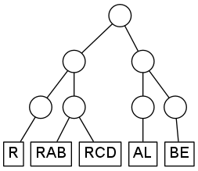

MLPF Input File Syntax
======================

Input files for MLPF use a syntax similar to MCTDH.
Parameters are organized into sections, which are enclosed in directives like
```
XXX-SECTION
END-XXX-SECTION
```
The file must end with the directive `END-INPUT`.

The following describes the individual sections.


RUN-SECTION
-----------

This section controls parameters for input, output, and what exactly to compute.
Directives are simply keywords, or of the form `keyword = parameter(s)`.
The following table lists the available directives.
_S_ specifies a string, _I_ an integer, and _R_ a real-valued parameter, which might
include a unit (in the same manner as MCTDH, e.g. "1.0,eV"). Square brackets indicate
optional parameters.

| Directive         | Description                                                                                                                 |
| ----------------- | --------------------------------------------------------------------------------------------------------------------------- |
| name = _S_        | Output will be put into the directory _S_.                                                                                  |
| gendvr            | DVR information will be generated and stored it in the file `dvr`.  This requires a PRIMITIVE-BASIS-SECTION to be present   |
| readdvr [= _S_]   | DVR information will be read from the file _S_. If unspecified, _S_ is `dvr`.                                               |
| genpot            | A full-grid potential will be computed and stored, in a format depending on _vpot-format_.                                  |
| readvpot [= _S_]  | A full-grid potential will be read from the file _S_. If unspecified, _S_ is `vpot` or `vpot2`, depending on _vpot-format_. |
| readnpot [= _S_]  | A Potfit potential will be read from the file _S_. If unspecified, _S_ is `natpot`.                                         |
| vpot-format = _I_ | Format for full-grid potential. _I_ must be 1 or 2.                                                                         |
| rmse = _R_        | Set the maximum allowed root-mean-square error of the fitted potential to _R_.                                              |
| graphviz          | Produce a file `tree.dot` which can be used to visualize the multi-layer tree using [Graphviz](http://www.graphviz.org/).   |


PRIMITIVE-BASIS-SECTION
-----------------------
(may be abbreviated to PBASIS-SECTION)

This section defines the coordinate system, and which grid points to use for each coordinate.
Each line describes one primitive coordinate, using the syntax

    Modelabel   BasisType   Parameters...

This is the same format as the corresponding section in MCTDH.  Therefore, please see the
[corresponding MCTDH documentation](http://www.pci.uni-heidelberg.de/tc/usr/mctdh/doc/mctdh/input_docu.html#pbasiskey)
for details of specifying the basis and parameters.

The idea is that you can copy & paste your PBASIS-SECTION from your MCTDH input file.
However, there are currently two caveats:

* MLPF was written from scratch, so the input file parser may not reproduce all MCTDH quirks and bugs accurately.
* At the moment, only a subset of primitive basis types are implemented by MLPF, namely:
    * **HO** -- Harmonic oscillator (Hermite) DVR
    * **Leg** -- Legendre DVR
    * **sin** -- Sine (Chebychev) DVR
    * **FFT** -- Fast Fourier transform collocation
    * **exp** -- Exponential DVR (periodic boundary conditions)
    * **K** -- magnetic quantum number basis


TREE-SECTION
------------

This section defines how the primitive modes are hierarchically combined
into larger and larger modes, and (optionally) specifies how many "single-particle potentials" (SPPs)
should be used for each mode.  So this section fulfills a similar role to the
`ML-BASIS-SECTION` used in MCTDH for ML-MCTDH runs, but the syntax is rather different.
Instead, the syntax in the `TREE-SECTION` is a minimal extension of the syntax used
in the `NATPOT-BASIS-SECTION` in Potfit and the `SPF-BASIS-SECTION` in MCTDH input files.

The basic element in this section is a statement of the form

    Modelabel1 [, Modelabel2 ... ] [ = nspp ]

which signifies that the given modelabels (which must have been present in the PBASIS-SECTION)
are combined into a _primitive mode_, and that _nspp_ SPPs should be
employed for this mode.  To combine the primitive modes into higher-layer modes, simply group
the primitive modes together with parentheses. After the closing parenthesis, you can (optionally)
specify the number of SPPs for the combined mode, again using `= nspp`.
This mode grouping must be applied recursively, such that you eventually enclose the whole block
by one final pair of parentheses.

To give an example, suppose that your system contains five degrees of freedom, with modelabels
R, RAB, RCD, AL, and BE.  You want to organize the modes into the following hierarchy:



Without specifying the number of SPPs, the corresponding TREE-SECTION is:

    TREE-SECTION
    (
      (
        R
        RAB,RCD
      )
      (
        AL
        BE
      )
    )
    END-TREE-SECTION

Line-breaks are not significant here, so you might as well write:

    TREE-SECTION
    ( ( R  RAB,RCD )  ( AL BE ) )
    END-TREE-SECTION


### Should I specify the number of SPPs? ###

Most likely not. What you usually want is a potential fit which fulfills a certain
accuracy criterium. MLPF supports this by setting the allowed global root-mean-square error
of the fit with the `rmse` parameter in the `RUN-SECTION`.  If this is supplied, and no
SPP numbers are given in the `TREE-SECTION`, then the following strategy is applied:

1. The allowed RMSE is divided equally by the total number of modes. (In the above example,
   there are 7 modes. However, here the top mode has only two children, such that for the
   top mode, a regular SVD is used instead of a higher-order SVD. This allows a more
   optimistic error estimate, such that the effective number of modes -- as far as the
   RMSE is concerned -- is reduced by one.)
2. Looking at the bottom layer, for each primitive mode the number of SPPs is chosen such
   that the RMSE contributed from this mode does not exceed the per-mode limit.
3. The actual RMSE for each primitive mode is estimated (the estimate is a strict upper
   bound) and subtracted from the total RMSE budget.
4. This updated RMSE budget is divided by the remaining number of modes, giving an updated
   per-mode limit.
5. Steps 2--4 are repeated for the next higher layer, and so on, until the top is reached.

If the TREE-SECTION specifies the number of SPPs for any mode, than that number is used,
instead of the one which the above algorithm would choose. If the number of SPPs is only
specified for some but not all modes, then the situation may arise that the RMSE budget
is exhausted before the top is reached. In this case MLPF will produce a fit which is not
truncated in the higher layers, which is far from optimal. Hence, if you specify the number
of SPPs for any mode, you should do so for all modes, and live with whatever RMSE results
from that.

The (estimated) RMSE error for each mode, and the number of SPPs chosen, is written to the `log` file.

